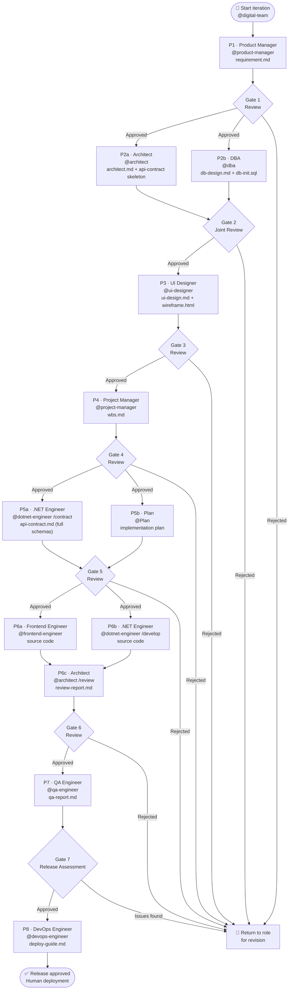

# forgeai

[](https://code.visualstudio.com/) [](https://github.com/features/copilot) [](https://www.anthropic.com/claude-code) [](https://github.com/openai/codex)

[中文](README.zh-CN.md)

A structured AI agent toolkit for GitHub Copilot, designed for software delivery teams.

by [jordium.com](https://jordium.com)

---

forgeai provides 10 specialist AI agents for GitHub Copilot — one per delivery role. Each agent has defined inputs, outputs, and handoff points. A coordinator agent (`@digital-team`) connects them into a sequential workflow with human gate reviews between phases.

Current backend support: .NET. Java support is planned for a future release.

Adapters for Claude Code and OpenAI Codex CLI are also available. See [Claude Code & Codex CLI](#claude-code--codex-cli) below.

---

## Roles

| Phase | Role              | Agent                | Output                                           |
| ----- | ----------------- | -------------------- | ------------------------------------------------ |
| P1    | Product Manager   | `@product-manager`   | `.ai/temp/requirement.md`                        |
| P2a   | Architect         | `@architect`         | `.ai/temp/architect.md` · `.ai/temp/api-contract.md` (skeleton) |
| P2b   | DBA               | `@dba`               | `.ai/temp/db-design.md` · `.ai/temp/db-init.sql` |
| P3    | UI Designer       | `@ui-designer`       | `.ai/temp/ui-design.md`                          |
| P4    | Project Manager   | `@project-manager`   | `.ai/temp/wbs.md`                                |
| P5a   | .NET Engineer     | `@dotnet-engineer`   | `.ai/temp/api-contract.md` (completed)           |
| P5b   | Plan              | `@Plan`              | Implementation plan                              |
| P6a   | Frontend Engineer | `@frontend-engineer` | Source code                                      |
| P6b   | .NET Engineer     | `@dotnet-engineer`   | Source code                                      |
| P6c   | Architect         | `@architect`         | `.ai/reports/architect/review-report-{v}.md`     |
| P7    | QA Engineer       | `@qa-engineer`       | `.ai/reports/qa-report.md`                       |
| P8    | DevOps Engineer   | `@devops-engineer`   | `.ai/reports/devops-engineer/deploy-guide-{v}.md` |

`@digital-team` is the Orchestrator. It reads `.ai/temp/` to detect the current phase, displays progress, and runs gate reviews.

## Workflow



---

## Requirements

- VS Code 1.99 or later with the GitHub Copilot and GitHub Copilot Chat extensions installed and active
- PowerShell 7+ (`pwsh`) for the installer

Install PowerShell 7 if not already present:

```sh
# Windows
winget install Microsoft.PowerShell

# macOS
brew install powershell
```

---

## Installation

### 1. Clone the repository

```sh
git clone https://github.com/jordium/jordium-forgeai.git
cd jordium-forgeai
```

### 2. Run the installer

```sh
pwsh ./install.ps1
```

The installer detects your OS and shows the default target path for each component (agents, skills, instructions, prompts). Press Enter to accept a path or type a replacement.

Available flags:

| Flag          | Effect                                                  |
| ------------- | ------------------------------------------------------- |
| `-Force`      | Overwrite files that already exist                      |
| `-DryRun`     | Preview all planned operations without writing anything |
| `-SkipSkills` | Skip installing skill definitions                       |

Default paths:

| OS | Agents / Instructions / Prompts | Skills |
| OS | Agents / Instructions / Prompts | Skills |
|----|----------------------------------|--------|
| Windows | `%APPDATA%\Code\User\` | `%USERPROFILE%\.copilot\skills\` |
| macOS | `~/Library/Application Support/Code/User/` | `~/.copilot/skills/` |
| Linux | `~/.config/Code/User/` | `~/.copilot/skills/` |

### 3. Reload VS Code

```
Ctrl+Shift+P  >  Developer: Reload Window
```

Agents and instructions are loaded at startup. The reload is required after the first install.

### 4. Grant file-write permission to `digital-team`

> **Why this matters:** `digital-team` and all specialist agents write their deliverables (requirements, architecture docs, DB design, etc.) directly to `.ai/temp/`. Without the **Edit files** permission, every document is printed to the Chat window instead, consuming large amounts of context and degrading the quality of downstream agents.

1. Open the Copilot Chat panel in VS Code
2. Click the **Tools** icon to the left of the input box
3. Make sure **Edit files** is checked
4. `digital-team` performs this check automatically on every startup. If the permission is missing it will pause and guide you through enabling it — you can also choose to continue without it (documents will print to Chat instead).

---

## Uninstall

```sh
pwsh ./uninstall.ps1
```

Removes all installed agents, skills, instructions, and prompts, and restores `settings.json` to its pre-install state. If you had a `chat.pluginLocations` entry before installing forgeai, the original value is preserved; if the key did not exist, it is removed entirely.

To preview what will be removed without making any changes:

```sh
pwsh ./uninstall.ps1 -DryRun
```

---

## Claude Code & Codex CLI

The same 10-role workflow is available for Claude Code and OpenAI Codex CLI. No installer is required — copy one config file to your project root.

### Platform support

All three platforms run on Windows, macOS, and Linux.

| Platform | Requirement | Config file |
|---|---|---|
| GitHub Copilot | VS Code 1.99+, `pwsh install.ps1` | Deployed via installer |
| Claude Code | Claude Code CLI | `CLAUDE.md` in project root or `~/.claude/` |
| Codex CLI | OpenAI Codex CLI | `AGENTS.md` in project root |

### Setup

**Claude Code — copy to project root:**

```sh
cp claude-code/CLAUDE.md /path/to/your/project/CLAUDE.md
```

Or place at the global location to apply to all projects:

```sh
# macOS / Linux
cp claude-code/CLAUDE.md ~/.claude/CLAUDE.md

# Windows
cp claude-code\CLAUDE.md $env:USERPROFILE\.claude\CLAUDE.md
```

**Codex CLI — copy to project root:**

```sh
cp codex/AGENTS.md /path/to/your/project/AGENTS.md
```

**Simplified Chinese locale:**

```sh
# Claude Code
cp zh-CN/claude-code/CLAUDE.md /path/to/your/project/CLAUDE.md

# Codex CLI
cp zh-CN/codex/AGENTS.md /path/to/your/project/AGENTS.md
```

### Trigger phrases

Invoke any role by prefixing your message with its trigger phrase. After each phase, a gate review card is shown — type `approve` to advance or `return [reason]` to revise.

| Trigger | Role |
|---|---|
| `status` | Orchestrator — check current phase |
| `PM:` | Product Manager (P1) |
| `Architect:` | Architect (P2a) |
| `DBA:` | DBA (P2b) |
| `UI:` | UI Designer (P3) |
| `Project Manager:` | Project Manager (P4) |
| `API contract:` | .NET Engineer — contract (P5a) |
| `Plan:` | Technical Plan (P5b) |
| `Frontend:` | Frontend Engineer (P6a) |
| `.NET:` | .NET Engineer — dev (P6b) |
| `Code review:` | Architect — code review (P6c) |
| `QA:` | QA Engineer (P7) |
| `DevOps:` | DevOps Engineer (P8) |

> Claude Code and Codex CLI run the entire workflow in a single conversation thread. Role context is set by your trigger phrase — there is no automatic agent switching.

---

## Language Support

ForgeAI installs in **English by default**. The output language of agent-generated deliverables (requirements, architecture docs, DB design, etc.) is controlled per-project by the `output_language` field in `.ai/context/workflow-config.md`.

### Chinese (Simplified) Users

A full Simplified Chinese locale is available in the `zh-CN/` directory — all agent and skill files are in Chinese:

```sh
pwsh ./zh-CN/install.ps1
```

This installs the same components from the `zh-CN/copilot/` source tree.

### Setting the output language for a project

After running `/init-project`, open `.ai/context/workflow-config.md` and set:

```yaml
output_language: "zh-CN" # en-US | zh-CN | ja-JP
```

All agents read this value at startup and write their deliverables in the specified language.

---

## Scrum Mode

By default forgeai uses `standard` delivery mode: all phase outputs are written to a single `.ai/temp/` directory. For projects with multiple releases and sprints, enable Scrum mode during project init.

### Enabling Scrum mode

During `/init-project`, answer **Q9** with `scrum`. The prompt then asks for the first version and sprint name (e.g. `v1.0`, `sprint-1`).

This creates the following directory structure:

```
.ai/
├── context/                    # Shared config — not versioned
├── v1.0/
│   ├── sprint-1/
│   │   ├── temp/               # Phase outputs for this sprint
│   │   └── reports/            # QA and review reports for this sprint
│   └── sprint-2/
│       ├── temp/
│       └── reports/
└── records/                    # Engineer work logs (continuous, not per-sprint)
```

The `workflow-config.md` file tracks the active context:

```yaml
delivery_mode: "scrum"
current_version: "v1.0"
current_sprint: "sprint-1"
```

`digital-team` and all specialist agents resolve their file paths from these values automatically.

### Starting a new sprint or version

1. Update `current_version` and `current_sprint` in `.ai/context/workflow-config.md`
2. Create the new directories: `.ai/{version}/{sprint}/temp/` and `.ai/{version}/{sprint}/reports/`
3. Restart `digital-team` — it will detect the empty sprint and start from Phase 1

### Standalone agent usage in Scrum mode

All agents read the path configuration automatically. If invoked standalone and `current_version` / `current_sprint` are not set in the config, the agent will ask you to specify them:

```
@dotnet-engineer  implement the order approval API
# Agent asks: "Scrum mode is active. Which version and sprint should I use?"
```

---

## Project Setup

In a new project workspace, run the following in Copilot Chat:

```
/init-project MyProject fullstack
```

This creates a `.ai/` directory in the project root:

```
.ai/
├── context/
│   ├── workflow-config.md       # Role on/off switches, tech stack, design approach, and output_language
│   ├── architect_constraint.md  # Architecture and library constraints
│   └── ui_constraint.md         # Brand colours, style tone, layout — filled manually before UI phase
├── temp/                        # Phase outputs (written by each agent)
├── records/                     # Engineer work logs
└── reports/                     # QA reports
```

### Configure before starting

Open `.ai/context/workflow-config.md` and set the following fields before the first iteration:

#### `db_approach` — database schema strategy

```yaml
db_approach: "database-first"  # default
```

| Value | Behaviour |
|---|---|
| `database-first` | DBA outputs a ready-to-run `db-init.sql`. Engineers read it to write ORM entities. Use when the schema is the authoritative source of truth. |
| `code-first` | DBA outputs a design document only. Engineers drive the schema via ORM migrations (e.g. EF Core). Use when the codebase owns the schema lifecycle. |

#### `design_approach` — phase order for UI design

```yaml
design_approach: "architecture-first"  # default
```

| Value | Phase order | Best for |
|---|---|---|
| `architecture-first` | PM → Architect → DBA → **UI Designer** → … | B2B / industrial / high-integration systems. UI Designer reads `requirement.md` + `architect.md` to ensure the design stays within technical constraints. |
| `ui-first` | PM → **UI Designer** → Architect → DBA → … | C-side products or prototype-driven projects. Architect and DBA additionally read `ui-design.md` so their designs accommodate the desired UX. |

#### `ui_constraint.md` — brand and style constraints

This file is **filled manually** by the PM, tech lead, or designer — not generated by AI.
Fill it in before `@ui-designer` runs. It contains:

- **Brand colours** — 12 CSS custom property values (`primary`, `danger`, `surface`, etc.)
- **Style tone** — `clean-light` / `enterprise-gray` / `professional-dark`
- **UI library** — must match the `ui_library` value in the Tech Stack section
- **Typography and layout** — base font size, sidebar width, border radius, etc.

If any field is left blank, `@ui-designer` will propose and apply a neutral enterprise default and state the chosen value in its output.

`@ui-designer` uses these values in two ways:
1. Defines matching CSS custom properties in the Style Variables section of `ui-design.md`
2. Applies them at the top of the `<style>` block in the generated `ui-wireframe.html`

---

## Usage

### Start an iteration

1. Open Copilot Chat and switch to Agent mode
2. Select `digital-team`
3. State the iteration goal, for example:
   ```
   Iteration goal: implement user permissions module — role assignment and menu-level access control
   ```

The Orchestrator reads current phase state and tells you what to do next.

### Gate reviews

After each phase, the Orchestrator presents a summary and two options: approve to advance to the next phase, or reject to send the current phase back for revision.

### Skip a role

Open `.ai/context/workflow-config.md` and mark any role as skipped:

```
ui-designer:       skip | no frontend
frontend-engineer: skip | no frontend
```

Roles with a skip entry are excluded from the workflow for the current project. The Orchestrator reads this file at startup.

### Use roles individually

All agents work independently without going through the Orchestrator:

```
@architect  assess whether event sourcing is needed for operation auditing

@dba  design the permissions-related tables, reference .ai/temp/architect.md

@frontend-engineer  implement the permissions page, reference .ai/temp/ui-design.md Task #3
```

### Agent phase modes

Some agents serve more than one phase in the workflow and behave differently depending on how they are invoked:

| Agent | Phase | Mode | Behaviour |
|-------|-------|------|-----------|
| `@dotnet-engineer` | P5a · API Contract | `/contract` | Fills request/response schemas in `api-contract.md`. Outputs documentation only — no code. |
| `@dotnet-engineer` | P6b · Backend Dev | `/develop` (default) | Implements backend code using `api-contract.md` as the authoritative spec. |
| `@architect` | P2a · Architecture | `/design` (default) | Produces architecture design and API contract skeleton. |
| `@architect` | P6c · Code Review | `/review` | Reviews engineer deliverables for standards, structure, performance, and API completeness. |

`digital-team` passes the correct mode automatically when routing through the workflow. When invoked standalone:
- Agents default to their primary mode (`/develop` for `@dotnet-engineer`, `/design` for `@architect`)
- If required prerequisite files are absent **and** no task is described in the prompt, the agent asks for clarification rather than proceeding with assumptions

---

## Coding Standards

Two instruction files are applied automatically via `applyTo` glob patterns:

| File                                        | Auto-applied to                                |
| ------------------------------------------- | ---------------------------------------------- |
| `coding-standards-dotnet.instructions.md`   | `**/*.cs`                                      |
| `coding-standards-frontend.instructions.md` | `**/*.vue`, `**/*.ts`, `**/*.tsx`, `**/*.scss` |

To add project-specific overrides, copy `project-template/.github/instructions/` into your workspace and fill in the marked sections. Project-level files take precedence over global ones.

---

## Repository Structure

```
jordium-forgeai/
├── install.ps1
├── uninstall.ps1
├── zh-CN/                     Simplified Chinese locale
│   ├── install.ps1
│   └── copilot/               Chinese versions of agents, skills, instructions, and prompts
├── shared/                    Platform-agnostic role and standard definitions
│   ├── roles/
│   └── standards/
├── copilot/                   GitHub Copilot — full implementation (English)
│   ├── agents/
│   ├── skills/
│   ├── instructions/
│   └── prompts/
├── claude-code/               Claude Code adapter — copy CLAUDE.md to project root
│   └── CLAUDE.md
├── codex/                     Codex CLI adapter — copy AGENTS.md to project root
│   └── AGENTS.md
└── project-template/          Copy to new project workspace
    ├── .github/instructions/
    └── .ai/context/
```

---

## Issues

File a GitHub Issue for:

- Installation failures — include OS, PowerShell version, and the full error output
- Agent behavior not matching the role spec — include the role name, your input, and the expected vs. actual output
- Feature requests — describe the problem or use case

---

## Premium Models and Network Access

forgeai works best with Claude Sonnet or CodeX in Copilot's premium request mode. Larger context windows and stronger instruction-following improve role adherence across the 10-agent workflow.

Premium request models require a GitHub Copilot Individual or Business subscription with premium request credits enabled.

### Mainland China Users

GitHub Copilot and its model endpoints may be inaccessible in mainland China without a proxy. We recommend DOVE: [dovee.cc](https://dovee.cc/aff.php?anaxjgyz1ozZq2B).
This is a referral link. Ensure VPN usage complies with applicable local laws and regulations.

---

## License

MIT. Copyright 2025 Jordium.com Engineering Team. See [LICENSE](./LICENSE).
