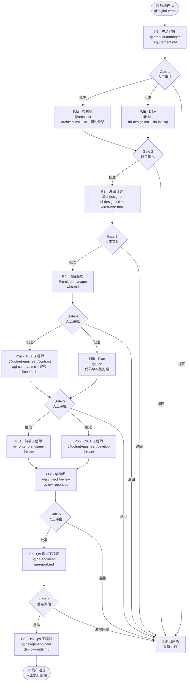

# forgeai

[](https://code.visualstudio.com/)

面向软件交付团队的 GitHub Copilot AI Agent 工具包。

by [jordium.com](https://jordium.com)

---

forgeai 为 GitHub Copilot 提供 10 个专业 AI Agent，每个 Agent 对应一个交付角色，拥有明确的输入、输出和移交协议。协调者 Agent（`@digital-team`）将它们串联成顺序工作流，每个阶段之间设置人工门控审批。

当前后端支持：.NET。Java 支持计划在后续版本中加入。

Claude Code 和 OpenAI Codex CLI 平台适配版现已可用，支持完整的 10 角色工作流。详见下方 [Claude Code 与 Codex CLI](#claude-code-与-codex-cli) 章节。

---

## 角色列表

| 阶段 | 角色             | Agent                | 产出文件                                         |
| ---- | ---------------- | -------------------- | ------------------------------------------------ |
| P1   | 产品经理         | `@product-manager`   | `.ai/temp/requirement.md`                        |
| P2a  | 架构师           | `@architect`         | `.ai/temp/architect.md` · `.ai/temp/api-contract.md`（骨架） |
| P2b  | DBA 数据库设计师 | `@dba`               | `.ai/temp/db-design.md` · `.ai/temp/db-init.sql` |
| P3   | UI 设计师        | `@ui-designer`       | `.ai/temp/ui-design.md`                          |
| P4   | 项目经理         | `@project-manager`   | `.ai/temp/wbs.md`                                |
| P5a  | .NET 工程师      | `@dotnet-engineer`   | `.ai/temp/api-contract.md`（完整）               |
| P5b  | Plan             | `@Plan`              | 代码级技术实施方案                               |
| P6a  | 前端工程师       | `@frontend-engineer` | 源代码                                           |
| P6b  | .NET 工程师      | `@dotnet-engineer`   | 源代码                                           |
| P6c  | 架构师           | `@architect`         | `.ai/reports/architect/review-report-{v}.md`     |
| P7   | QA 测试工程师    | `@qa-engineer`       | `.ai/reports/qa-report.md`                       |
| P8   | DevOps 工程师   | `@devops-engineer`   | `.ai/reports/devops-engineer/deploy-guide-{v}.md` |

`@digital-team` 是协调者。它读取 `.ai/temp/` 识别当前阶段、显示进度、执行门控审批。

## 工作流程



---

## 前置要求

- VS Code 1.99 或更高版本，已安装并启用 GitHub Copilot 和 GitHub Copilot Chat 扩展
- PowerShell 7+（`pwsh`）用于运行安装脚本

未安装 PowerShell 7 时：

```sh
# Windows
winget install Microsoft.PowerShell

# macOS
brew install powershell
```

---

## 安装

### 1. 克隆仓库

```sh
git clone https://github.com/jordium/jordium-forgeai.git
cd jordium-forgeai
```

### 2. 运行安装脚本

```sh
pwsh ./install.ps1
```

脚本自动检测操作系统，逐一显示每个组件（agents、skills、instructions、prompts）的默认安装路径。按 Enter 确认，或输入新路径替换。

可用参数：

| 参数          | 效果                         |
| ------------- | ---------------------------- |
| `-Force`      | 覆盖已存在的文件             |
| `-DryRun`     | 预览所有操作，不写入任何文件 |
| `-SkipSkills` | 跳过安装 skill 定义文件      |

各系统默认路径：

| 系统    | Agents / Instructions / Prompts            | Skills                           |
| ------- | ------------------------------------------ | -------------------------------- |
| Windows | `%APPDATA%\Code\User\`                     | `%USERPROFILE%\.copilot\skills\` |
| macOS   | `~/Library/Application Support/Code/User/` | `~/.copilot/skills/`             |
| Linux   | `~/.config/Code/User/`                     | `~/.copilot/skills/`             |

### 3. 重新加载 VS Code

```
Ctrl+Shift+P  >  Developer: Reload Window
```

Agent 和 instruction 在启动时加载，首次安装后必须重新加载才能生效。

### 4. 授予 `digital-team` 文件写入权限

> **为什么重要：**`digital-team` 及各专业角色 Agent 将产出物（需求文档、架构设计、数据库设计等）直接写入 `.ai/temp/`。若没有 **Edit files** 权限，所有文档将改为在 Chat 窗口输出，大量消耗上下文，影响后续角色的工作质量。

1. 打开 VS Code Copilot Chat 面板
2. 点击输入框左侧「工具 / Tools」图标
3. 确认「**Edit files（文件编辑）**」已勾选
4. `digital-team` 在**每次启动时自动检查权限**。若权限缺失，将暂停流程并引导你开启——也可选择不授权继续（文档将在 Chat 中输出）。

---

## 卸载

```sh
pwsh ./uninstall.ps1
```

删除所有已安装的 agents、skills、instructions 和 prompts，并将 `settings.json` 还原至安装前的状态。若安装前 `chat.pluginLocations` 已存在其他配置，卸载后将自动还原；若安装前该键不存在，则整个键将被移除。

预览将要删除的内容（不实际删除）：

```sh
pwsh ./uninstall.ps1 -DryRun
```

---

## Claude Code 与 Codex CLI

同样的 10 角色工作流已适配 Claude Code 和 OpenAI Codex CLI。无需安装脚本，仅需将配置文件复制到项目根目录即可使用。

### 平台支持

三个平台均支持 Windows、macOS 和 Linux。

| 平台 | 前提条件 | 配置文件 |
|---|---|---|
| GitHub Copilot | VS Code 1.99+，`pwsh install.ps1` | 通过安装脚本部署 |
| Claude Code | Claude Code CLI | 项目根目录或 `~/.claude/` 下的 `CLAUDE.md` |
| Codex CLI | OpenAI Codex CLI | 项目根目录下的 `AGENTS.md` |

### 配置方法

**Claude Code — 复制到项目根目录：**

```sh
cp zh-CN/claude-code/CLAUDE.md /path/to/your/project/CLAUDE.md
```

或放置到全局目录，对所有项目生效：

```sh
# macOS / Linux
cp zh-CN/claude-code/CLAUDE.md ~/.claude/CLAUDE.md

# Windows
cp zh-CN\claude-code\CLAUDE.md $env:USERPROFILE\.claude\CLAUDE.md
```

**Codex CLI — 复制到项目根目录：**

```sh
cp zh-CN/codex/AGENTS.md /path/to/your/project/AGENTS.md
```

> 英文版请将路径中的 `zh-CN/` 前缀去掉，使用 `claude-code/CLAUDE.md` 和 `codex/AGENTS.md`。

### 触发词

在对话中以触发词开头即可激活对应角色。角色完成后显示门控审批卡，输入 `approve` 推进下一阶段，输入 `return [原因]` 退回修改。

| 触发词 | 角色 |
|---|---|
| `status` | 协调者 —— 查看当前阶段 |
| `PM:` 或 `需求分析:` | 产品经理（P1） |
| `Architect:` 或 `架构设计:` | 架构师（P2a / P6c） |
| `DBA:` 或 `数据库设计:` | DBA（P2b） |
| `UI:` 或 `UI设计:` | UI 设计师（P3） |
| `Project Manager:` 或 `项目计划:` | 项目经理（P4） |
| `API contract:` 或 `接口契约:` | .NET 工程师 —— 契约（P5a） |
| `Plan:` 或 `实施方案:` | 技术方案（P5b） |
| `Frontend:` 或 `前端开发:` | 前端工程师（P6a） |
| `.NET:` 或 `后端开发:` | .NET 工程师 —— 开发（P6b） |
| `Code review:` 或 `代码审查:` | 架构师 —— 代码审查（P6c） |
| `QA:` 或 `测试:` | QA 测试工程师（P7） |
| `DevOps:` 或 `部署:` | DevOps 工程师（P8） |

> Claude Code 和 Codex CLI 在单一对话线程中运行完整工作流，通过触发词切换角色上下文——没有自动 Agent 切换机制。

---

## 初始化新项目

在项目工作区的 Copilot Chat 中运行：

```
/init-project MyProject fullstack
```

这将在项目根目录创建 `.ai/` 目录：

```
.ai/
├── context/
│   ├── workflow-config.md       # 角色启用/跳过开关、技术栈、设计顺序、输出语言
│   ├── architect_constraint.md  # 架构与库约束
│   └── ui_constraint.md         # 品牌配色、风格基调、布局规范 — UI 阶段开始前手工填写
├── temp/                        # 各阶段产出文件（由 Agent 自动写入）
├── records/                     # 工程师工作日志
└── reports/                     # QA 报告
```

### 开始前的配置

运行正式迭代前，请打开 `.ai/context/workflow-config.md` 配置以下字段：

#### `db_approach` — 数据库 Schema 策略

```yaml
db_approach: "database-first"  # 默认
```

| 取值 | 行为 |
|---|---|
| `database-first` | DBA 输出可直接执行的 `db-init.sql`，工程师参考此文件编写 ORM 实体类。适合以 Schema 为唯一权威来源的项目。 |
| `code-first` | DBA 仅输出设计文档，工程师通过 ORM Migration 驱动 Schema（如 EF Core）。适合由代码主导 Schema 生命周期的项目。 |

#### `design_approach` — UI 设计阶段顺序

```yaml
design_approach: "architecture-first"  # 默认
```

| 取值 | 阶段顺序 | 适用场景 |
|---|---|---|
| `architecture-first` | PM → 架构 → DBA → **UI 设计师** → … | B2B / 工业软件 / 高集成度系统。UI 设计师读取 `requirement.md` + `architect.md`，确保设计在技术约束内。 |
| `ui-first` | PM → **UI 设计师** → 架构 → DBA → … | C 端产品或原型驱动项目。架构师和 DBA 额外读取 `ui-design.md`，使技术设计适配期望的用户体验。 |

#### `ui_constraint.md` — 品牌与风格约束

该文件由 PM、技术负责人或设计师**手工填写**，不由 AI 生成。
请在 `@ui-designer` 运行前填写完毕，内容包含：

- **品牌配色** — 12 个 CSS 自定义属性值（`primary`、`danger`、`surface` 等）
- **风格基调** — `clean-light`（极简白底）/ `enterprise-gray`（灰底卡片）/ `professional-dark`（深色侧边栏）
- **UI 组件库** — 必须与技术栈中的 `ui_library` 一致
- **字体与布局** — 基准字号、侧边栏宽度、圆角大小等

若字段留空，`@ui-designer` 将自行提案并应用中性企业级默认属性，并在产出中说明所选值。

`@ui-designer` 将该文件的内容应用于两处产出：
1. 在 `ui-design.md` 的样式变量节定义匹配的 CSS 自定义属性
2. 在 `ui-wireframe.html` 的 `<style>` 块顶部直接应用这些变量

---

## Scrum 模式

默认情况下 forgeai 使用 `standard` 交付模式：所有阶段产出写入单一的 `.ai/temp/` 目录。对于具有多版本和多 Sprint 的项目，可在初始化时开启 Scrum 模式。

### 开启 Scrum 模式

在 `/init-project` 问答中，对 **Q9** 选择 `scrum`，然后填写第一个版本号和 Sprint 名称（如 `v1.0`、`sprint-1`）。

生成的目录结构如下：

```
.ai/
├── context/                    # 全局配置 — 不随版本变化
├── v1.0/
│   ├── sprint-1/
│   │   ├── temp/               # 本 Sprint 的阶段产出
│   │   └── reports/            # 本 Sprint 的 QA 与 Review 报告
│   └── sprint-2/
│       ├── temp/
│       └── reports/
└── records/                    # 工程师工作日志（连续归档，不按 Sprint 割裂）
```

`workflow-config.md` 跟踪当前活动上下文：

```yaml
delivery_mode: "scrum"
current_version: "v1.0"
current_sprint: "sprint-1"
```

`digital-team` 和所有专业角色 Agent 均自动根据这些字段解析文件路径。

### 启动新 Sprint 或新版本

1. 在 `.ai/context/workflow-config.md` 中更新 `current_version` 和 `current_sprint`
2. 创建新目录：`.ai/{version}/{sprint}/temp/` 和 `.ai/{version}/{sprint}/reports/`
3. 重新启动 `digital-team` — 它会检测到空的新 Sprint 并从 Phase 1 开始

### Scrum 模式下的独立调用

所有 Agent 均自动读取路径配置。若独立调用时 `current_version` / `current_sprint` 尚未设置，Agent 会主动询问：

```
@dotnet-engineer  实现订单审批 API
# Agent 询问："当前项目为 Scrum 模式，请问要使用哪个版本和 Sprint？"
```

---

## 使用说明

### 启动一次迭代

1. 打开 Copilot Chat，切换到 Agent 模式
2. 选择 `digital-team`
3. 描述本次迭代目标，例如：
   ```
   本次迭代目标：实现用户权限管理模块，支持角色分配和菜单级权限控制
   ```

Orchestrator 读取当前阶段状态，告知下一步操作。

### 门控审批

每个阶段完成后，Orchestrator 展示摘要，提供两个选项：批准推进到下一阶段，或退回当前阶段重新执行。

### 跳过某个角色

打开 `.ai/context/workflow-config.md`，将对应角色标记为跳过：

```
ui-designer:       ⏭ 跳过 | 无前端界面
frontend-engineer: ⏭ 跳过 | 无前端界面
```

有跳过标记的角色在本项目的工作流中不会被执行。Orchestrator 在启动时读取此文件。

### 独立调用单个角色

所有 Agent 均可不经过 Orchestrator 直接使用：

```
@architect  评估是否需要引入事件溯源支持操作审计

@dba  设计权限相关表结构，参考 .ai/temp/architect.md

@frontend-engineer  实现权限管理页面，参考 .ai/temp/ui-design.md 中 Task #3
```

### Agent 阶段模式

部分 Agent 在工作流中承担多个阶段的任务，根据调用方式的不同表现出不同行为：

| Agent | 阶段 | 模式 | 行为说明 |
|-------|------|------|----------|
| `@dotnet-engineer` | P5a · API 契约定义 | `/contract` | 填写 `api-contract.md` 中的完整 Request/Response Schema，仅输出制文档，不编写代码 |
| `@dotnet-engineer` | P6b · 后端开发 | `/develop`（默认）| 以 `api-contract.md` 为权威规范实现后端代码 |
| `@architect` | P2a · 架构设计 | `/design`（默认）| 完成架构设计并输出 API 契约骨架 |
| `@architect` | P6c · 代码 Review | `/review` | 对工程师成果物进行规范合规、结构、性能、接口完整性评审 |

通过 `digital-team` 工作流调用时，模式标志由 Orchestrator 自动传递。独立调用规则：
- 未指定模式标志时，Agent 默认使用主模式（`@dotnet-engineer` 默认 `/develop`，`@architect` 默认 `/design`）
- 若所需前置成果物（如 `.ai/temp/wbs.md`、`.ai/temp/requirement.md`）不存在，且提示词中未描述具体任务，Agent 将主动向用户询问任务内容，而不是自行假设并继续

---

## 编码规范

两个 instruction 文件通过 `applyTo` 匹配模式自动加载：

| 文件                                        | 自动适用于                                     |
| ------------------------------------------- | ---------------------------------------------- |
| `coding-standards-dotnet.instructions.md`   | `**/*.cs`                                      |
| `coding-standards-frontend.instructions.md` | `**/*.vue`, `**/*.ts`, `**/*.tsx`, `**/*.scss` |

如需添加项目特有覆盖规则，将 `project-template/.github/instructions/` 复制到项目工作区并填写标注的内容区块。项目级文件优先于全局文件生效。

---

## 仓库结构

```
jordium-forgeai/
├── install.ps1
├── shared/                    平台无关的角色与规范定义
│   ├── roles/
│   └── standards/
├── copilot/                   GitHub Copilot 完整实现
│   ├── agents/
│   ├── skills/
│   ├── instructions/
│   └── prompts/
├── claude-code/               Claude Code 适配器 —— 将 CLAUDE.md 复制到项目根目录
│   └── CLAUDE.md
├── codex/                     Codex CLI 适配器 —— 将 AGENTS.md 复制到项目根目录
│   └── AGENTS.md
└── project-template/          新项目初始化时复制到工作区
    ├── .github/instructions/
    └── .ai/context/
```

---

## 问题反馈

通过 GitHub Issue 提交以下类型的问题：

- 安装失败——请提供操作系统、PowerShell 版本和完整错误输出
- Agent 行为与角色规范不符——请提供角色名称、输入内容、预期与实际输出
- 功能需求——请描述具体问题或使用场景

---

## 高级模型与网络访问

forgeai 在 Copilot 高级请求模式下效果最佳（Claude Sonnet/Opus, Codex, GPT-5.4等高级模型）。更大的上下文窗口和更强的指令遵循能力，在 10 个 Agent 的工作流中能显著提升角色行为一致性和代码质量。

使用高级模型需要 GitHub Copilot Individual 或 Business 订阅，并开启高级请求额度。

### 中国大陆用户

GitHub Copilot 及其模型接口在中国大陆可能需要代理访问。推荐使用 DOVE：[dovee.cc](https://dovee.cc/aff.php?anaxjgyz1ozZq2B)。
以上为推广链接。请确保 VPN 使用符合当地法律法规。

---

## 许可证

MIT. Copyright 2025 Jordium.com Engineering Team. 详见 [LICENSE](./LICENSE)。
